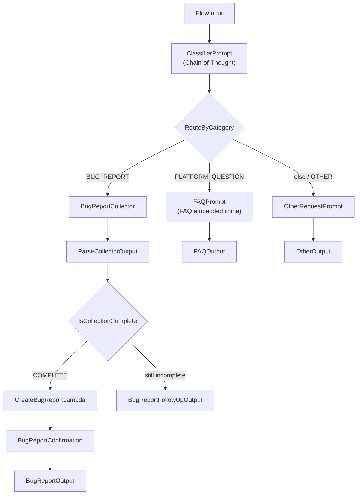

# Customer Support Chatbot with Amazon Bedrock Flows

A customer support chatbot for a fictional online shop, built with **Amazon Bedrock Flows**. The chatbot classifies incoming customer messages and routes them to one of three behaviors:

- **Bug reports** — collects a description, steps to reproduce, and environment across a multi-turn conversation, then files a ticket in DynamoDB via a Lambda tool.
- **Platform questions** — answers questions about orders, shipping, returns, and payments using an FAQ embedded directly in the prompt.
- **Other requests** — politely redirects the customer to a human support phone line.

## Architecture note: why no Agent node

This project originally called for a Bedrock Agent node to handle the bug-report path. **Bedrock Agents Classic closed to new customers on July 30, 2026**, and Bedrock Flows has no native node for the newer AgentCore harness. Instead, the bug-report path is built from three chained node types:

1. **Prompt node** (`BugReportCollector`) — a ReAct-style prompt that reasons over the conversation so far, asks one clarifying question at a time for whatever's missing, and emits a structured `COMPLETE: {json}` marker once description, steps to reproduce, and environment are all collected.
2. **InlineCode node** (`ParseCollectorOutput`) — a small Python snippet that parses the Prompt node's raw text output into a clean `{status, description, stepsToReproduce, environment, message}` object, since Bedrock Flow Condition nodes can only do exact string/number comparisons, not text parsing.
3. **Lambda function node** (`CreateBugReportLambda`) — invokes the `create_bug_report` Lambda to persist the ticket to DynamoDB.

Because Bedrock Flows has no native mid-conversation "pause and wait for the customer" mechanism outside of Agent nodes, multi-turn collection works by having the caller resend the growing conversation transcript as the input on each turn — the `BugReportCollector` prompt is designed to reason over "the conversation so far" rather than relying on built-in session memory.

## Flow diagram




## Project files

| File | Description |
|------|-------------|
| `cloudformation-tool.yaml` | Deploys the DynamoDB ticket table, the `create_bug_report` Lambda, and its IAM execution role. |
| `cloudformation-testing.yaml` | Deploys the S3 bucket and IAM role used for Bedrock Evaluations. |
| `create_bug_report.py` | Lambda function source (also embedded inline in `cloudformation-tool.yaml`). Accepts either a plain JSON payload or the `event.node.inputs[0].value` envelope that Bedrock Flow Lambda nodes send. |
| `online_shop_faq.md` | The FAQ content embedded directly into the `FAQPrompt` node. |
| `flow-tests.json` | Test suite covering all three routes plus edge cases (ambiguous, very short, prompt injection). |
| `generate-eval-dataset.py` | Invokes the deployed Flow against `flow-tests.json` and writes `output_eval_dataset.jsonl` for Bedrock Evaluations. |
| `output_eval_dataset.jsonl` | Generated evaluation dataset from the latest test run. |
| `OBSERVATIONS.md` | Written observations from the Bedrock Evaluations run. |
| `requirements.txt` | Python dependencies for `generate-eval-dataset.py`. |

## Getting started

### Dependencies

- An AWS account with Amazon Bedrock access enabled, in **us-east-1**.
- AWS CLI v2, configured with credentials that can deploy CloudFormation stacks and use Bedrock.
- Python 3.9+.
- Access to the `amazon.nova-pro-v1:0` model in Bedrock.

### Step 1 — Deploy the bug-report tool

```bash
aws cloudformation deploy \
  --template-file cloudformation-tool.yaml \
  --stack-name bug-report-tool-stack \
  --capabilities CAPABILITY_NAMED_IAM \
  --region us-east-1
```

Retrieve the outputs (table name, Lambda ARN, role ARN):

```bash
aws cloudformation describe-stacks \
  --stack-name bug-report-tool-stack \
  --query "Stacks[0].Outputs" \
  --output table \
  --region us-east-1
```

### Step 2 — Build the Flow

The Flow itself is built in the Bedrock console (Amazon Bedrock → Flows → Create flow), following the architecture diagram above. Key configuration notes:

- All Prompt nodes use the `amazon.nova-pro-v1:0` model.
- The `ClassifierPrompt` node uses Chain-of-Thought prompting and must output exactly one of `BUG_REPORT`, `PLATFORM_QUESTION`, or `OTHER` (Condition nodes require exact string matches).
- The `FAQPrompt` node has the full contents of `online_shop_faq.md` pasted directly into its message text.
- The `CreateBugReportLambda` node points at the Lambda deployed in Step 1.
- Every Condition node branch — including "if all conditions are false" — needs **two** wires into the downstream node: the conditional trigger from the Condition node *and* a direct data wire from whichever upstream node actually produced the data. The conditional wire alone only controls routing; it doesn't carry the payload.

Once built, **Publish a version** and **create an alias** — you'll need the Flow ID and Alias ID for testing.

### Step 3 — Test manually

Use the **Test flow** panel in the Bedrock Flows console. For the bug-report path, since Flows are stateless per invocation, simulate later turns by pasting the whole conversation so far as a single message, e.g.:

Customer: The checkout page keeps crashing when I try to pay
Assistant: Could you please provide the exact steps you took before the page crashed?
Customer: I add an item to my cart, go to checkout, and click Pay — that's when it crashes. I'm using Chrome on Windows 11.


### Step 4 — Automated testing and evaluation

For the AgentCore harness, create the local harness and run a fresh chat:

```bash
python create_harness.py
python chat.py
```

Run the automated harness test suite and generate a Bedrock Evaluations JSONL
dataset:

```bash
python generate-eval-dataset.py \
  --tests-json harness-tests.json \
  --harness-tests \
  --gateway-url <YOUR_GATEWAY_MCP_URL> \
  --region us-east-1 \
  --out-jsonl harness-output-eval.jsonl
```

The generated file can be uploaded to the evaluation S3 bucket and used with
the Bedrock Evaluations commands below. `harness-tests-template.json` is a
starting point for adding more cases. The primary suite uses one fresh,
single-turn conversation per test. To verify full bug-report collection across
multiple turns, run:

```bash
python generate-eval-dataset.py \
  --tests-json harness-multiturn-tests.json \
  --harness-tests \
  --gateway-url <YOUR_GATEWAY_MCP_URL> \
  --region us-east-1 \
  --out-jsonl harness-multiturn-output-eval.jsonl
```

Set up the Python environment:

```bash
python -m venv venv
.\venv\Scripts\Activate.ps1   # Windows PowerShell
pip install -r requirements.txt
```

Run the test suite against your deployed Flow:

```bash
python generate-eval-dataset.py --tests-json flow-tests.json --flow-id <YOUR_FLOW_ID> --flow-alias-id <YOUR_ALIAS_ID> --region us-east-1
```

Deploy the testing stack:

```bash
aws cloudformation deploy \
  --template-file cloudformation-testing.yaml \
  --stack-name bug-report-testing-stack \
  --capabilities CAPABILITY_NAMED_IAM \
  --region us-east-1
```

Upload the dataset and create the evaluation job (replace bucket/role from the stack outputs):

```bash
aws s3 cp output_eval_dataset.jsonl s3://<EvalDatasetBucketName>/output_eval_dataset.jsonl --region us-east-1

aws bedrock create-evaluation-job \
  --job-name support-chatbot-eval-run-1 \
  --role-arn <BedrockEvalRoleArn> \
  --evaluation-config '{"automated":{"datasetMetricConfigs":[{"taskType":"General","dataset":{"name":"support-chatbot-eval-dataset","datasetLocation":{"s3Uri":"s3://<EvalDatasetBucketName>/output_eval_dataset.jsonl"}},"metricNames":["Builtin.Correctness"]}],"evaluatorModelConfig":{"bedrockEvaluatorModels":[{"modelIdentifier":"amazon.nova-pro-v1:0"}]}}}' \
  --inference-config '{"models":[{"precomputedInferenceSource":{"inferenceSourceIdentifier":"my-flow-app"}}]}' \
  --output-data-config '{"s3Uri":"s3://<EvalDatasetBucketName>/results/"}' \
  --region us-east-1
```

Check status until it shows `Completed`:

```bash
aws bedrock get-evaluation-job --job-identifier <jobArn> --region us-east-1 --query "status" --output text
```

View results in Amazon Bedrock → Evaluations in the console.

## Cleanup

```bash
aws cloudformation delete-stack --stack-name bug-report-tool-stack --region us-east-1
aws s3 rm s3://<EvalDatasetBucketName> --recursive --region us-east-1
aws cloudformation delete-stack --stack-name bug-report-testing-stack --region us-east-1
```

Also delete the Flow, its versions, and its alias from the Bedrock console if no longer needed.

## Built with

- [Amazon Bedrock Flows](https://docs.aws.amazon.com/bedrock/latest/userguide/flows.html) — orchestration
- [AWS Lambda](https://aws.amazon.com/lambda/) — bug report tool runtime
- [Amazon DynamoDB](https://aws.amazon.com/dynamodb/) — bug report storage
- [Amazon Bedrock Evaluations](https://docs.aws.amazon.com/bedrock/latest/userguide/evaluation.html) — LLM-as-a-judge evaluation

## License

See [LICENSE.md](LICENSE.md).

# customer-support-chatbot


